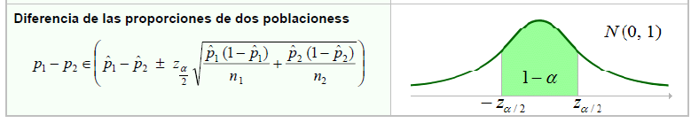

```{=html}
<div style="position: absolute; top: 10px; right: 10px;">
  
</div>
```

```{=html}
<style type="text/css">
  body {
    font-size: 130%;
    text-align: justify;
  }
</style>
```

# .Activar Paquetes

```{r}
if(!require(kableExtra)) {
  install.packages("kableExtra")}
library(kableExtra)

if(!require(tidyverse)) {
  install.packages("tidyverse")}
library(tidyverse)

if(!require(OneTwoSamples)) {
  install.packages("OneTwoSamples")}
library(OneTwoSamples)

if(!require(DescTools)) {
  install.packages("DescTools")}
library(DescTools)
```

# .Intervalos de Confianza

Para distribuciones simétricas los intervalos de confianza siguen la forma:

$$
\hat{\theta} \pm MoE
$$

donde:

$$
\hat{\theta} = \text{estadístico o estimador}
$$

$$
MoE = \text{margen de error}$$

$$SE \cdot stat_{crit,1-\alpha,\nu}
$$

$$
SE = \text{error estándar}
$$

$$
1 - \alpha = \text{nivel de confianza}
$$

$$
\nu = \text{grados de libertad}
$$

Para distribuciones asimétricas los intervalos de confianza siguen la forma:

$$
\hat{\theta}_{i} < \hat{\theta} < \hat{\theta}_{s}
$$

donde:

$$
\hat{\theta}_{i} = \text{límite inferior}
$$

$$
\hat{\theta}_{s} = \text{límite superior}
$$

# .Media de la Población-Varianza Poblacional Conocida

**Fórmula Completa del Intervalo**

$$\mu \in \left( 
\bar{x} - z_{\alpha/2}\frac{\sigma}{\sqrt{n}},
\ \bar{x} + z_{\alpha/2}\frac{\sigma}{\sqrt{n}}
\right)$$

La fórmula principal del intervalo de confianza para la media con varianza poblacional conocida es:

$$\bar{x} \pm z_{\alpha/2}\frac{\sigma}{\sqrt{n}}$$


**Ejercicio 1**

La Secretaría de Atención Ciudadana de la alcaldía de un municipio desea evaluar el tiempo promedio que tardan los funcionarios en resolver solicitudes de los ciudadanos.

Con base en estudios históricos, se sabe que la desviación estándar poblacional del tiempo de respuesta es de 4 días.

Se selecciona una muestra aleatoria de 64 solicitudes y se obtiene un tiempo promedio de resolución de 18 días.

La administración municipal desea construir un intervalo de confianza del 95% para estimar el tiempo promedio poblacional de respuesta a las solicitudes ciudadanas.

**Solución**

::: panel-tabset
## Respuesta

```{r}
# Intervalo de confianza para la media poblacional
# Varianza poblacional conocida

# Datos del ejercicio
n <- 64
media_muestral <- 18
sigma <- 4
nivel_confianza <- 0.95

# Valor crítico Z
alpha <- 1 - nivel_confianza
z <- qnorm(1 - alpha/2)

# Error estándar
error_estandar <- sigma / sqrt(n)

# Margen de error
margen_error <- z * error_estandar

# Límites del intervalo de confianza
limite_inferior <- media_muestral - margen_error
limite_superior <- media_muestral + margen_error

# Resultados
cat("Intervalo de confianza del 95% para la media poblacional:\n")
cat("Límite inferior =", round(limite_inferior, 2), "\n")
cat("Límite superior =", round(limite_superior, 2), "\n")
```

## Gráfica

```{r}
# Intervalo de confianza para la media poblacional
# Gráfica con ggplot2

# Librería
library(ggplot2)

# Datos del ejercicio
media <- 18
sigma <- 4
n <- 64
z <- 1.96

# Error estándar
error_estandar <- sigma / sqrt(n)

# Límites del intervalo de confianza
LI <- media - z * error_estandar
LS <- media + z * error_estandar

# Valores para la curva
x <- seq(16, 20, length = 1000)

# Distribución normal de la media muestral
datos <- data.frame(
  x = x,
  y = dnorm(x, mean = media, sd = error_estandar)
)

# Área sombreada
sombreado <- subset(datos, x >= LI & x <= LS)

# Gráfica
ggplot(datos, aes(x = x, y = y)) +
  
  # Curva normal
  geom_line(color = "darkblue", linewidth = 1.3) +
  
  # Área sombreada del IC
  geom_area(
    data = sombreado,
    aes(x = x, y = y),
    fill = "skyblue",
    alpha = 0.5
  ) +
  
  # Límites del intervalo
  geom_vline(
    xintercept = LI,
    color = "red",
    linetype = "dashed",
    linewidth = 1
  ) +
  
  geom_vline(
    xintercept = LS,
    color = "red",
    linetype = "dashed",
    linewidth = 1
  ) +
  
  # Media
  geom_vline(
    xintercept = media,
    color = "darkgreen",
    linewidth = 1
  ) +
  
  # Etiquetas
  labs(
    title = "Intervalo de Confianza del 95% para la Media",
    subtitle = paste(
      "IC95% = [",
      round(LI, 2),
      ",",
      round(LS, 2),
      "]"
    ),
    x = "Tiempo promedio de resolución (días)",
    y = "Densidad"
  ) +
  
  theme_minimal(base_size = 14)
```
:::

**Interpretación**

Con un 95% de confianza se puede estimar que el verdadero tiempo promedio poblacional de respuesta de las solicitudes ciudadanas por parte de la Secretaría de Atencion Ciudadana está entre 17.02 y 18.98 días. Y habra una probabilidad del 5% de estimar valores para dicha verdadera media por fuera del anterior intervalo.

# .Media de la Población-Varianza Poblacional Desconocida

**Fórmula Completa del Intervalo**

$$\mu \in \left(
\bar{x} - t_{(\alpha/2,n-1)}\frac{s}{\sqrt{n}},
\ \bar{x} + t_{(\alpha/2,n-1)}\frac{s}{\sqrt{n}}
\right)$$

La fórmula principal del intervalo de confianza para la media con varianza poblacional desconocida es:

$$\bar{x} \pm t_{(\alpha/2,n-1)}\frac{s}{\sqrt{n}}$$


**Ejercicio 2**

La Unidad Administrativa Especial de Catastro de una ciudad colombiana desea evaluar el tiempo promedio que tardan los analistas en aprobar trámites de actualización catastral.

Para ello, se seleccionó una muestra aleatoria de 25 trámites procesados durante el último mes. Los resultados mostraron un tiempo promedio de aprobación de 14 días, con una desviación estándar muestral de 3 días.

La entidad desea construir un intervalo de confianza del 95% para estimar el tiempo promedio poblacional de aprobación de trámites.

**Solución**

::: panel-tabset
## Respuesta

```{r}
# Intervalo de confianza para la media poblacional
# Varianza poblacional desconocida
# Datos del ejercicio de Catastro

# Datos del ejercicio
n <- 25
media_muestral <- 14
s <- 3
nivel_confianza <- 0.95

# Grados de libertad
gl <- n - 1

# Valor crítico t
alpha <- 1 - nivel_confianza
t_critico <- qt(1 - alpha/2, df = gl)

# Error estándar
error_estandar <- s / sqrt(n)

# Margen de error
margen_error <- t_critico * error_estandar

# Límites del intervalo de confianza
limite_inferior <- media_muestral - margen_error
limite_superior <- media_muestral + margen_error

# Resultados
cat("Intervalo de confianza del 95% para la media poblacional:\n")
cat("Límite inferior =", round(limite_inferior, 2), "\n")
cat("Límite superior =", round(limite_superior, 2), "\n")
```

## Gráfica

```{r}
# Intervalo de confianza para la media
# Distribución t de Student

library(ggplot2)

# Datos
media <- 14
s <- 3
n <- 25
gl <- n - 1

# Valor crítico t
t_critico <- qt(0.975, df = gl)

# Error estándar
error_estandar <- s / sqrt(n)

# Intervalo de confianza
LI <- media - t_critico * error_estandar
LS <- media + t_critico * error_estandar

# Valores para la curva
x <- seq(media - 5, media + 5, length = 1000)

# Distribución t
datos <- data.frame(
  x = x,
  y = dt((x - media) / error_estandar, df = gl) / error_estandar
)

# Área sombreada
sombreado <- subset(datos, x >= LI & x <= LS)

# Gráfica
ggplot(datos, aes(x = x, y = y)) +
  
  geom_line(color = "purple", linewidth = 1.3) +
  
  geom_area(
    data = sombreado,
    aes(x = x, y = y),
    fill = "plum",
    alpha = 0.5
  ) +
  
  geom_vline(
    xintercept = LI,
    color = "red",
    linetype = "dashed",
    linewidth = 1
  ) +
  
  geom_vline(
    xintercept = LS,
    color = "red",
    linetype = "dashed",
    linewidth = 1
  ) +
  
  geom_vline(
    xintercept = media,
    color = "darkgreen",
    linewidth = 1
  ) +
  
  labs(
    title = "Intervalo de Confianza del 95% para la Media",
    subtitle = paste(
      "IC95% = [",
      round(LI, 2),
      ",",
      round(LS, 2),
      "]"
    ),
    x = "Tiempo promedio de aprobación (días)",
    y = "Densidad"
  ) +
  
  theme_minimal(base_size = 14)
```
:::

**Interpretación**

Con un 95% de confianza, se puede afirmar que el tiempo promedio que tarda la entidad pública en aprobar los trámites de actualización catastral se encuentra entre 12.76 y 15.24 días.Y habra una probabilidad de 5% de estimar valores para dicha verdadera media por fuera del intervalo anterior.

# .Proporción de la Población

**Fórmula Completa del Intervalo**

$$p \in \left(
\hat{p} - z_{\alpha/2}\sqrt{\frac{\hat{p}(1-\hat{p})}{n}},
\ \hat{p} + z_{\alpha/2}\sqrt{\frac{\hat{p}(1-\hat{p})}{n}}
\right)$$

Para el intervalo de confianza de una proporción poblacional:

$$\hat{p} \pm z_{\alpha/2}\sqrt{\frac{\hat{p}(1-\hat{p})}{n}}$$


**Ejercicio 3**

La Empresa de Transporte Masivo de una ciudad colombiana desea estimar la proporción de usuarios satisfechos con el nuevo sistema digital de recarga de tarjetas implementado en las estaciones principales.

Para ello, se seleccionó una muestra aleatoria de 400 usuarios. De los encuestados, 312 manifestaron estar satisfechos con el servicio.

La entidad desea construir un intervalo de confianza del 99% para estimar la proporción poblacional de usuarios satisfechos.

**Solución**

::: panel-tabset
## Respuesta

```{r}
# Intervalo de confianza para una proporción poblacional
# Datos del ejercicio de transporte masivo

# Datos del ejercicio
n <- 400
x <- 312
nivel_confianza <- 0.99

# Proporción muestral
p_hat <- x / n

# Valor crítico Z
alpha <- 1 - nivel_confianza
z <- qnorm(1 - alpha/2)

# Error estándar
error_estandar <- sqrt((p_hat * (1 - p_hat)) / n)

# Margen de error
margen_error <- z * error_estandar

# Límites del intervalo de confianza
limite_inferior <- p_hat - margen_error
limite_superior <- p_hat + margen_error

# Resultados
cat("Intervalo de confianza del 99% para la proporción poblacional:\n")
cat("Límite inferior =", round(limite_inferior, 4), "\n")
cat("Límite superior =", round(limite_superior, 4), "\n")
```

## Gráfica

```{r}
# Intervalo de confianza para una proporción poblacional

library(ggplot2)

# Datos
n <- 400
x <- 312
confianza <- 0.99

# Proporción muestral
p_hat <- x / n

# Valor crítico Z
z <- qnorm(0.995)

# Error estándar
error_estandar <- sqrt((p_hat * (1 - p_hat)) / n)

# Intervalo de confianza
LI <- p_hat - z * error_estandar
LS <- p_hat + z * error_estandar

# Valores para la curva
x_vals <- seq(
  p_hat - 4 * error_estandar,
  p_hat + 4 * error_estandar,
  length = 1000
)

# Distribución normal
datos <- data.frame(
  x = x_vals,
  y = dnorm(x_vals, mean = p_hat, sd = error_estandar)
)

# Área sombreada
sombreado <- subset(datos, x >= LI & x <= LS)

# Gráfica
ggplot(datos, aes(x = x, y = y)) +
  
  geom_line(color = "darkorange", linewidth = 1.3) +
  
  geom_area(
    data = sombreado,
    aes(x = x, y = y),
    fill = "gold",
    alpha = 0.5
  ) +
  
  geom_vline(
    xintercept = LI,
    color = "red",
    linetype = "dashed",
    linewidth = 1
  ) +
  
  geom_vline(
    xintercept = LS,
    color = "red",
    linetype = "dashed",
    linewidth = 1
  ) +
  
  geom_vline(
    xintercept = p_hat,
    color = "darkgreen",
    linewidth = 1
  ) +
  
  labs(
    title = "Intervalo de Confianza del 99% para una Proporción",
    subtitle = paste(
      "IC99% = [",
      round(LI, 4),
      ",",
      round(LS, 4),
      "]"
    ),
    x = "Proporción de usuarios satisfechos",
    y = "Densidad"
  ) +
  
  theme_minimal(base_size = 14)
```
:::

**Interpretación**

Con un 99% de confianza, se puede afirmar que la proporción real de usuarios satisfechos con el sistema digital de recarga de la Empresa de Transporte Masivo se encuentra entre 72.66% y 83.33%.Y esto significa que existe únicamente un 1% de probabilidad de que la verdadera proporción poblacional de usuarios satisfechos se encuentre fuera de ese intervalo de confianza.

# .Varianza de la Población

**Intervalo de Confianza para la Varianza Poblacional**

$$\sigma^2 \in \left(
\frac{(n-1)s^2}{\chi^2_{(\alpha/2,n-1)}},
\ \frac{(n-1)s^2}{\chi^2_{(1-\alpha/2,n-1)}}
\right)$$

**Límite Inferior**

$$L_i = \frac{(n-1)s^2}{\chi^2_{(\alpha/2,n-1)}}$$

**Límite Superior**

$$L_s = \frac{(n-1)s^2}{\chi^2_{(1-\alpha/2,n-1)}}$$


**Ejercicio 4**

La Empresa de Energía Pública de una ciudad colombiana desea analizar la variabilidad en el tiempo de respuesta a las solicitudes de reconexión del servicio eléctrico.

Para ello, se seleccionó una muestra aleatoria de 10 solicitudes atendidas durante una semana. Los tiempos de respuesta, medidos en horas, fueron los siguientes:

12,15,10,18,14,11,16,13,17,14

La entidad desea construir un intervalo de confianza del 95% para estimar la varianza poblacional de los tiempos de respuesta.

**Solución**

::: panel-tabset
## Respuesta

```{r}
# Datos muestrales: tiempos de respuesta de reconexión eléctrica
muestra <- c(12, 15, 10, 18, 14, 11, 16, 13, 17, 14)

# Tamaño de la muestra
n <- length(muestra)

# Calcular la varianza muestral
var_muestral <- var(muestra)

# Nivel de confianza del 95%
alpha <- 0.05
chi2_izq <- qchisq(1 - alpha / 2, df = n - 1)  # Cuantil superior
chi2_der <- qchisq(alpha / 2, df = n - 1)      # Cuantil inferior

# Calcular el intervalo de confianza para la varianza
lim_inf <- (n - 1) * var_muestral / chi2_izq
lim_sup <- (n - 1) * var_muestral / chi2_der

# Mostrar los resultados
cat("La varianza muestral es:", var_muestral, "\n")
```

```{r}
# Intervalo de confianza para la varianza poblacional
# Empresa de Energía Pública

# Datos muestrales
datos <- c(12, 15, 10, 18, 14, 11, 16, 13, 17, 14)

# Tamaño de la muestra
n <- length(datos)

# Varianza muestral
s2 <- var(datos)

# Nivel de confianza
nivel_confianza <- 0.95

# Nivel de significancia
alpha <- 1 - nivel_confianza

# Grados de libertad
gl <- n - 1

# Valores críticos chi-cuadrado
chi_superior <- qchisq(alpha/2, df = gl, lower.tail = FALSE)
chi_inferior <- qchisq(1 - alpha/2, df = gl, lower.tail = FALSE)

# Límites del intervalo de confianza
limite_inferior <- (gl * s2) / chi_superior
limite_superior <- (gl * s2) / chi_inferior

# Resultados
cat("Intervalo de confianza del 95% para la varianza poblacional:\n")
cat("Límite inferior =", round(limite_inferior, 2), "\n")
cat("Límite superior =", round(limite_superior, 2), "\n")
```

## Gráfica

```{r}
# Intervalo de confianza para la varianza poblacional
# Distribución Ji-cuadrado

# Librería
library(ggplot2)

# Datos del ejercicio
datos_muestra <- c(12,15,10,18,14,11,16,13,17,14)

# Tamaño de muestra
n <- length(datos_muestra)

# Grados de libertad
gl <- n - 1

# Varianza muestral
s2 <- var(datos_muestra)

# Nivel de significancia
alpha <- 0.05

# Valores críticos Ji-cuadrado
chi_izq <- qchisq(alpha/2, df = gl)
chi_der <- qchisq(1 - alpha/2, df = gl)

# Intervalo de confianza
LI <- ((n - 1) * s2) / chi_der
LS <- ((n - 1) * s2) / chi_izq

# Valores para la curva
x <- seq(0, 30, length = 1000)

# Distribución Ji-cuadrado
datos <- data.frame(
  x = x,
  y = dchisq(x, df = gl)
)

# Área sombreada correcta
sombreado <- subset(datos, x >= chi_izq & x <= chi_der)

# Gráfica
ggplot(datos, aes(x = x, y = y)) +
  
  # Curva Ji-cuadrado
  geom_line(
    color = "darkred",
    linewidth = 1.3
  ) +
  
  # Área sombreada
  geom_area(
    data = sombreado,
    aes(x = x, y = y),
    fill = "tomato",
    alpha = 0.5
  ) +
  
  # Líneas críticas
  geom_vline(
    xintercept = chi_izq,
    color = "blue",
    linetype = "dashed",
    linewidth = 1
  ) +
  
  geom_vline(
    xintercept = chi_der,
    color = "blue",
    linetype = "dashed",
    linewidth = 1
  ) +
  
  # Etiquetas
  labs(
    title = "Distribución Ji-cuadrado",
    subtitle = paste(
      "IC95% para la varianza = [",
      round(LI, 2),
      ",",
      round(LS, 2),
      "]"
    ),
    x = expression(chi^2),
    y = "Densidad"
  ) +
  
  theme_minimal(base_size = 14)
```
:::

**Interpretación**

Con un 95% de confianza, se puede afirmar que la varianza poblacional del tiempo de respuesta a las solicitudes de reconexión eléctrica se encuentra entre 3.15 y 22.22 horas².Y habrá una probabilidad del 5% de encontrar valores para dicha verdadera varianza por fuera del anterior intervalo.

# .Diferencias de Dos Medias Poblacionales


Hay dos Casos:

## .Muestras Pareadas o Dependientes

$$\bar{X}_{d_i} \pm t_{(\alpha/2,\;n-1)} \frac{S_{d_i}}{\sqrt{n}}$$ $$\bar{X}_{d_i} = \frac{\sum d_i}{n}$$

$$S_{d_i}^{2} = \frac{\sum (d_i - \bar{d}_i)^2}{n-1}$$

$$S_{d_i} = \sqrt{S_{d_i}^{2}}$$

$$d_i = X_{antes} - X_{despues}$$

**Ejercicio 5**

La Secretaría de Atención Ciudadana de un municipio implementó un nuevo sistema digital para reducir el tiempo de respuesta en los trámites administrativos.

Para evaluar si el sistema mejoró la eficiencia, se seleccionaron 10 funcionarios públicos y se midió el tiempo promedio (en minutos) que tardaban en resolver un trámite antes y después de la implementación del sistema.

Los datos obtenidos fueron los siguientes:

| Funcionario | Antes | Después |
|-------------|-------|---------|
| 1           | 45    | 38      |
| 2           | 50    | 42      |
| 3           | 48    | 40      |
| 4           | 52    | 46      |
| 5           | 47    | 41      |
| 6           | 49    | 43      |
| 7           | 51    | 44      |
| 8           | 46    | 39      |
| 9           | 53    | 47      |
| 10          | 50    | 43      |

**Solución**

::: panel-tabset
## Resultado

```{r}
# Intervalo de confianza para muestras pareadas
# Secretaría de Atención Ciudadana

# Datos
antes <- c(45, 50, 48, 52, 47, 49, 51, 46, 53, 50)
despues <- c(38, 42, 40, 46, 41, 43, 44, 39, 47, 43)

# Diferencias
diferencias <- antes - despues

# Mostrar diferencias
diferencias

# Tamaño de muestra
n <- length(diferencias)

# Media de las diferencias
media_d <- mean(diferencias)

# Desviación estándar
sd_d <- sd(diferencias)

# Nivel de confianza
confianza <- 0.95
alpha <- 1 - confianza

# Valor crítico t
t_critico <- qt(1 - alpha/2, df = n - 1)

# Error estándar
error_estandar <- sd_d / sqrt(n)

# Margen de error
margen_error <- t_critico * error_estandar

# Intervalo de confianza
LI <- media_d - margen_error
LS <- media_d + margen_error

# Resultados
cat("Media de las diferencias:", round(media_d, 3), "\n")
cat("Desviación estándar:", round(sd_d, 3), "\n")
cat("Valor crítico t:", round(t_critico, 3), "\n")
cat("Error estándar:", round(error_estandar, 3), "\n")
cat("Intervalo de confianza al 95%: (",
    round(LI, 3), ",",
    round(LS, 3), ")\n")

```
:::

**Interpretación**

Con un 95% de confianza, la implementación del sistema digital redujo el tiempo promedio de atención entre aproximadamente 6.23 y 7.36 minutos por trámite.Y habrá una probabilidad del 5% de encontrar valores para dicha diferencia verdadera de medias por fuera del intervalo.

Como todo el intervalo es positivo, existe evidencia de que el nuevo sistema contribuyó a disminuir los tiempos de atención en la Secretría de Atención Ciudadana.

## .Muestras Independientes

Hay dos casos:

**Caso a): Diferencia de las Medias de Dos Poblaciones-Varianzas Desconocidas e Iguales**


**Caso b): Diferencia de las Medias de Dos Poblaciones-Varianzas Desconocidas y Distintas**


Para determinar si las varianzas poblacionales desconocidas son iguales o distintas, se debe calcular el siguiente intervalo para el cociente de dos varianzas poblacionales:


**Si el anterior intervalo contiene al número 1, las varianzas poblacionales desconocidas seran iguales, en caso contrario distintas**

### .Diferencia de las Medias de Dos Poblaciones-Varianzas Desconocidas e Iguales

**Ejercicio 6**

La Secretaría de Movilidad de una ciudad desea comparar el tiempo promedio de atención de solicitudes entre dos sedes administrativas: Sede Norte y Sede Sur.

Para ello, se seleccionaron aleatoriamente funcionarios de ambas sedes y se registró el tiempo (en minutos) que tardaron en resolver una solicitud ciudadana.

Los datos obtenidos fueron los siguientes:

| Sede Norte | Sede Sur |
|------------|----------|
| 32         | 28       |
| 35         | 30       |
| 31         | 27       |
| 30         | 26       |
| 29         | 29       |
| 34         | 31       |
| 33         | 25       |
| 36         | 32       |

**Solución**

::: panel-tabset
## Resultado

```{r}
# ==========================================
# Intervalo de confianza para diferencia
# de medias con varianzas iguales
# ==========================================

# Datos
norte <- c(32, 35, 31, 30, 29, 34, 33, 36)
sur   <- c(28, 30, 27, 26, 29, 31, 25, 32)

# ==========================================
# Estadísticos descriptivos
# ==========================================

n1 <- length(norte)
n2 <- length(sur)

media1 <- mean(norte)
media2 <- mean(sur)

var1 <- var(norte)
var2 <- var(sur)

sd1 <- sd(norte)
sd2 <- sd(sur)

cat("Media Sede Norte:", media1, "\n")
cat("Media Sede Sur:", media2, "\n\n")

cat("Varianza Sede Norte:", var1, "\n")
cat("Varianza Sede Sur:", var2, "\n\n")

# ==========================================
# Varianza combinada
# ==========================================

sp2 <- (((n1 - 1) * var1) + ((n2 - 1) * var2)) / (n1 + n2 - 2)

sp <- sqrt(sp2)

cat("Varianza combinada:", sp2, "\n")
cat("Desviación estándar combinada:", sp, "\n\n")

# ==========================================
# Error estándar
# ==========================================

SE <- sp * sqrt((1/n1) + (1/n2))

cat("Error estándar:", SE, "\n\n")

# ==========================================
# Valor crítico t
# ==========================================

alpha <- 0.05
gl <- n1 + n2 - 2

t_critico <- qt(1 - alpha/2, df = gl)

cat("Valor crítico t:", t_critico, "\n\n")

# ==========================================
# Intervalo de confianza
# ==========================================

dif_medias <- media1 - media2

margen_error <- t_critico * SE

LI <- dif_medias - margen_error
LS <- dif_medias + margen_error

cat("Diferencia de medias:", dif_medias, "\n")
cat("Margen de error:", margen_error, "\n\n")

cat("Intervalo de confianza al 95%:\n")
cat("(", round(LI, 3), ",", round(LS, 3), ")\n\n")

```
:::

**Interpretación**

Con un 95% de confianza, la diferencia entre los tiempos promedio de atención de la Sede Norte y la Sede Sur está entre 1.37 y 6.62 minutos. Y habrá una probabilidad del 5% de encontrar valores para dicha diferencia verdadera de medias por fuera del anterior intervalo.

Como el intervalo es completamente positivo, se concluye que la Sede Norte tarda en promedio más tiempo en atender solicitudes que la Sede Sur.

### .Diferencia de las Medias de Dos Poblaciones-Varianzas Desconocidas y Distintas

**Ejercicio 7**

La Secretaría de Hacienda de una ciudad desea comparar el tiempo promedio que tardan dos plataformas digitales en procesar solicitudes tributarias.

Se seleccionaron aleatoriamente dos grupos independientes de trámites y se registró el tiempo de procesamiento (en minutos).

Los resultados fueron los siguientes:

| Plataforma A | Plataforma B |
|--------------|--------------|
| 18           | 30           |
| 20           | 27           |
| 22           | 35           |
| 19           | 40           |
| 21           | 33           |
| 23           | 38           |
| 20           | 29           |
| 19           | 41           |

**Solución**

::: panel-tabset
## Resultado

```{r}
# ==========================================
# Intervalo de confianza para diferencia
# de medias con varianzas diferentes
# ==========================================

# Datos
plataforma_A <- c(18, 20, 22, 19, 21, 23, 20, 19)
plataforma_B <- c(30, 27, 35, 40, 33, 38, 29, 41)

# ==========================================
# Estadísticos descriptivos
# ==========================================

n1 <- length(plataforma_A)
n2 <- length(plataforma_B)

media1 <- mean(plataforma_A)
media2 <- mean(plataforma_B)

var1 <- var(plataforma_A)
var2 <- var(plataforma_B)

sd1 <- sd(plataforma_A)
sd2 <- sd(plataforma_B)

cat("Media Plataforma A:", media1, "\n")
cat("Media Plataforma B:", media2, "\n\n")

cat("Varianza Plataforma A:", var1, "\n")
cat("Varianza Plataforma B:", var2, "\n\n")

# ==========================================
# Error estándar (Welch)
# ==========================================

SE <- sqrt((var1 / n1) + (var2 / n2))

cat("Error estándar:", SE, "\n\n")

# ==========================================
# Grados de libertad de Welch
# ==========================================

gl <- ((var1/n1 + var2/n2)^2) /
      (((var1/n1)^2 / (n1 - 1)) +
       ((var2/n2)^2 / (n2 - 1)))

cat("Grados de libertad:", gl, "\n\n")

# ==========================================
# Valor crítico t
# ==========================================

alpha <- 0.05

t_critico <- qt(1 - alpha/2, df = gl)

cat("Valor crítico t:", t_critico, "\n\n")

# ==========================================
# Intervalo de confianza
# ==========================================

dif_medias <- media1 - media2

margen_error <- t_critico * SE

LI <- dif_medias - margen_error
LS <- dif_medias + margen_error

cat("Diferencia de medias:", dif_medias, "\n")
cat("Margen de error:", margen_error, "\n\n")

cat("Intervalo de confianza al 95%:\n")
cat("(", round(LI, 3), ",", round(LS, 3), ")\n\n")

```
:::

**Interpretación**

Con un 95% de confianza, la diferencia entre los tiempos promedio de procesamiento de las plataformas está entre −18.32 y −9.42 minutos. Y habrá una probabilidad del 5% de encontrar valores para dicha diferencia verdadera de medias por fuera del intervalo anterior.

Como el intervalo es completamente negativo, se concluye que la Plataforma A procesa solicitudes más rápidamente que la Plataforma B.

# .Diferencia de las Proporciones de Dos Poblaciones

**Fórmula**

$$
p_1 - p_2 \in 
\left(
\hat{p}_1 - \hat{p}_2
\pm
z_{\alpha/2}
\sqrt{
\frac{\hat{p}_1(1-\hat{p}_1)}{n_1}
+
\frac{\hat{p}_2(1-\hat{p}_2)}{n_2}
}
\right)$$



**Ejercicio 8**

El Ministerio de Salud de Colombia desea comparar la efectividad de dos campañas de vacunación digital implementadas en diferentes departamentos del país.

Se seleccionaron aleatoriamente ciudadanos en cada campaña y se registró si completaron exitosamente el agendamiento de vacunación por internet.

Los resultados fueron los siguientes:

| Campaña   | Agendamientos exitosos | Total de ciudadanos |
|-----------|------------------------|---------------------|
| Campaña A | 210                    | 300                 |
| Campaña B | 160                    | 290                 |

Construya un intervalo de confianza del 95% para la diferencia entre las proporciones poblacionales de éxito de las dos campañas digitales.

**Solución**

::: panel-tabset
## Resultado

```{r}
# ==========================================
# Intervalo de confianza para diferencia
# de dos proporciones poblacionales
# ==========================================

# Datos
x1 <- 210   # éxitos Campaña A
n1 <- 300   # total Campaña A

x2 <- 160   # éxitos Campaña B
n2 <- 290   # total Campaña B

# Proporciones muestrales
p1 <- x1 / n1
p2 <- x2 / n2

# Diferencia de proporciones
dif_prop <- p1 - p2

# Nivel de confianza
confianza <- 0.95
alpha <- 1 - confianza

# Valor crítico Z
z <- qnorm(1 - alpha/2)

# Error estándar
EE <- sqrt((p1*(1-p1))/n1 + (p2*(1-p2))/n2)

# Límites del intervalo
LI <- dif_prop - z * EE
LS <- dif_prop + z * EE

cat("Proporción Campaña A =", round(p1,4), "\n")
cat("Proporción Campaña B =", round(p2,4), "\n\n")

cat("Diferencia de proporciones =", round(dif_prop,4), "\n")
cat("Error estándar =", round(EE,4), "\n")
cat("Valor crítico Z =", round(z,4), "\n\n")

cat("Intervalo de confianza del 95%:\n")
cat("(", round(LI,4), ",", round(LS,4), ")\n")
```
:::

**Interpretación**

Con un 95% de confianza, la diferencia entre las proporciones poblacionales de éxito de las campañas digitales se encuentra entre 0.0711 y 0.2255.

Esto indica que la Campaña A tiene una proporción de éxito entre 7.11% y 22.55% mayor que la Campaña B en el agendamiento digital de vacunación.
